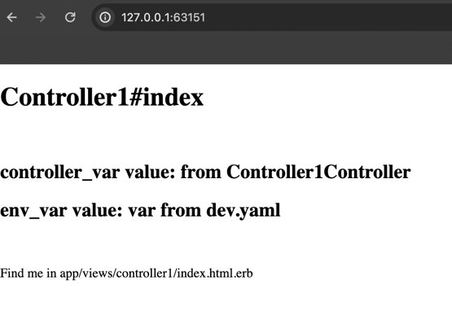
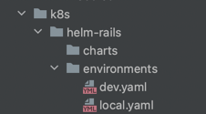
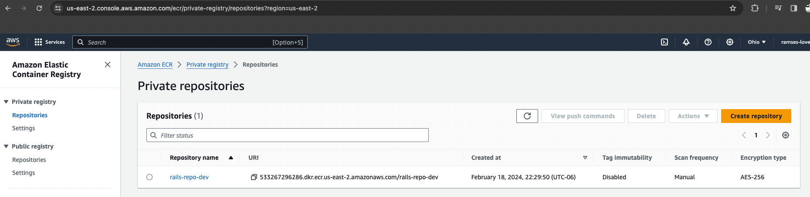
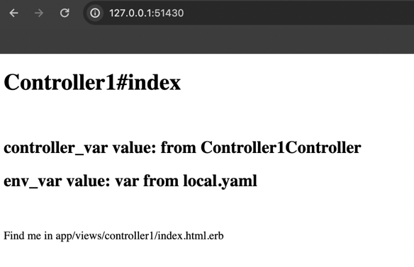

# Enviroment
- use asdf as terraform version manager
- terraform version 1.7.3
- AWS account for this test
- helm v3.9.2
- kubectl v1.29.2
- ruby 3.1.2p20 


# Project Structure
```bash
.
├── README.md
├── infra
│   ├── challenge
│   │   ├── build
│   │   │   ├── backend.tf
│   │   │   ├── environments
│   │   │   │   └── dev.tfvars
│   │   │   ├── locals.tf
│   │   │   ├── main.tf
│   │   │   ├── provider.tf
│   │   │   └── variables.tf
│   │   ├── deploy
│   │   │   ├── backend.tf
│   │   │   ├── environments
│   │   │   │   ├── dev.tfvars
│   │   │   │   ├── dev2.tfvars
│   │   │   │   └── local.tfvars
│   │   │   ├── main.tf
│   │   │   ├── provider.tf
│   │   │   └── variables.tf
│   │   ├── ecr
│   │   │   ├── backend.tf
│   │   │   ├── ecr.tfplan
│   │   │   ├── environments
│   │   │   │   └── dev.tfvars
│   │   │   ├── main.tf
│   │   │   ├── provider.tf
│   │   │   └── variables.tf
├── k8s
│   └── helm-rails
│       ├── Chart.yaml
│       ├── README.md
│       ├── charts
│       ├── environments
│       │   ├── dev.yaml
│       │   └── local.yaml
│       ├── templates
│       │   ├── NOTES.txt
│       │   ├── _helpers.tpl
│       │   ├── deployment.yaml
│       │   └── service.yaml
│       └── values.yaml
└── rails
    └── hello_world
        ├── Dockerfile
        ├── Gemfile
        ├── Gemfile.lock
        ├── README.md
        ├── Rakefile
        ├── app
        ├── bin
        ├── config
        ├── .
        ├── .
        ├── .
        

```

this project contains 3 big folders:

- infra
- k8s
- rails

## rails
rails folder contains a basic rails application that only show in the view "hello world" and some values of the controller 
- static variable
- environment variable

by default with the command `rails new <app_name>` the rails project contains the required files to execute the new application and a default Dockerfile
the only change for this exercise was setup the environment, by defails is production, but this require configure the secret_key_base for prod environment
```Dockerfile
RAILS_ENV="development"
```


this folder contains a readme with the details how the rails app was created and configured



 

## k8s
k8s folder contains the basic helm chart that contains all the configuration to allow a deployment and a service in kubernetes
the variables by environment like dev, stage, qa, prod, etc. are stored into `environments` folder these yaml's goal are store the basic values by enviromnent like replica numbers, ecr repo, image tag name, etc. by environment




```yaml
replicaCount: 2
containerPort: 3000
customEnvVar: "var from dev.yaml"
image:
    repository: 533267296286.dkr.ecr.us-east-2.amazonaws.com/rails-repo-dev
    tag: latest
```

to deploy the helm chart use the next command
```bash
helm install -f values.yaml --namespace default --values environments/dev.yaml local-rails .
```

## Infra

this folder contains all the main goal of the challenge and here is stored all the terraform code and configuration to create and deploy the rails app to k8s

All terraform folders store the state in a S3 bucket and DynamoDB table, the configuration for all these is in `backend.tf` file and use a local aws profile named `lovevery`

```
[lovevery]
aws_access_key_id     = AKIAXYKJVGA··············
aws_secret_access_key = YNpqfA/··············
region                = us-west-2
```


```terraform
terraform {
  backend "s3" {
    bucket         = "rcarb-love-infra"
    key            = "lovevery/ecr/vpc.tfstate"
    region         = "us-east-2"
    dynamodb_table = "lovevery-state"
    profile        = "lovevery"
  }
}

```

### ecr

here is the terraform code to deploy an ECR repository in the AWS account

this is used to store the docker image with the rails application



As all the terraform folders, the variables by environment are in environments folder, to deploy this resource use the next command

```bash
terraform init
terraform plan -out "ecr.tfplan" --var-file="environments/dev.tfvars"
terraform apply "ecr.tfplan"
```

### build

This terraform project allow the docker image build and push to a ECR registry.
By default the rails image can be created with the docker command

```bash
docker build -t 533267296286.dkr.ecr.us-east-2.amazonaws.com/rails-repo-dev .
docker push 533267296286.dkr.ecr.us-east-2.amazonaws.com/rails-repo-dev
```

the project use a null_resource that execute the command above amd login to the ecr repo

```bash
terraform init
terraform plan -out "build.tfplan" --var-file="environments/dev.tfvars"
terraform apply "build.tfplan"
```

### deploy
the deployment use `helm_release` resource to deploy the rails helm chart
this project use the environment files that are stored in the helm folder and the reference is defined in environments folder

```terraform
# dev.tfvars
environment = "dev"
environment-context = "minikube"
```

```terraform
# local.tfvars
environment = "local"
environment-context = "minikube"
```

for this deployment we will use the environment variable of the rails app each `environments/**.tfvars` is defined the context where the helm char will be deployed, "kubernetes" provider is defined in providers.tf file

```tf
provider "kubernetes" {
  config_path    = "~/.kube/config"
  config_context = var.environment-context
}
```

to deploy to dev env and use dev.yaml use the next command
```bash
terraform init
terraform plan -out "deploy.tfplan" --var-file="environments/dev.tfvars"
terraform apply "deploy.tfplan"
```


to deploy to local env and use local.yaml use the next command
```bash
terraform init
terraform plan -out "deploy.tfplan" --var-file="environments/local.tfvars"
terraform apply "deploy.tfplan"
```


## Manage Multiple Environments and secrets 

For helm and terraform i used a `enviroment` folder where are stored all the keys/values; the goal of these files is only manage the environment global configuration for example the `replicaCount` of the deployments in EKS, application name like `rails-app-<environment>`.
For terraform and example of manage the environments is the ECR repo created that contains the suffix of the environment defined in the `environment/dev.tfvars`

to manage the secrets like database users and password, can be used a configMap to setup as a environment variable in the deployment configuration, but something like AWS secrets manager can be better to allow the application download the secrets when the application start, but it depends on the rails application implement this feature


## Tests

in this iteration there are not any terraform test, it was only execute the next commands `terraform validate` `terraform fmt <files>`, `terraform plan` command is another way to validate if the terraform code is valid before execute the apply
a unit testing can be implemented in the project with `Terratest` in my experience i never used unit tests for the infrastructure but i can create some unit test and it require go language knowledge.
other kind of testing can be related to front end testing and reliability, cucumber, jmeter, etc. can be implemented to allow this tests
curl, telnet, netstat and others bash tools can help to verify the connectivity of the infra between remote connections and connections inside of the VPC
Datadog, new relic, can help to test and monitor the infrastructure health

in this case i think we can just use the next commands to verify if all the resources are in kubernetes

```bash
kubectl get pods
kubectl get deployments
kubectl get services
kubectl describe deployment <deployment>
kubectl describe service <service>
helm list
```


```bash
λ  deploy git:(challenge) ✗ kubectl get pods
NAME                                      READY   STATUS    RESTARTS   AGE
local-local-heml-rails-77fbc69474-5hh58   1/1     Running   0          29m
local-local-heml-rails-77fbc69474-bnlsz   1/1     Running   0          29m
```

```bash
local-local-heml-rails-77fbc69474-bnlsz   1/1     Running   0          29m
λ  deploy git:(challenge) ✗ kubectl get deployments
NAME                     READY   UP-TO-DATE   AVAILABLE   AGE
local-local-heml-rails   2/2     2            2           30m
```

```bash
λ  deploy git:(challenge) ✗ kubectl get services
NAME            TYPE        CLUSTER-IP       EXTERNAL-IP   PORT(S)          AGE
kubernetes      ClusterIP   10.96.0.1        <none>        443/TCP          31h
rails-service   NodePort    10.107.122.254   <none>        3000:32730/TCP   30m

```

```bash
λ  deploy git:(challenge) ✗ helm list
NAME            NAMESPACE       REVISION        UPDATED                                 STATUS          CHART                   APP VERSION
local-local     default         1               2024-02-20 00:02:47.329677 -0600 CST    deployed        heml-rails-0.1.0        1.16.0    
```

```bash
λ  deploy git:(challenge) ✗ kubectl describe deployment local-local-heml-rails
Name:                   local-local-heml-rails
Namespace:              default
CreationTimestamp:      Tue, 20 Feb 2024 00:02:47 -0600
Labels:                 app.kubernetes.io/instance=local-local
                        app.kubernetes.io/managed-by=Helm
                        app.kubernetes.io/name=heml-rails
                        app.kubernetes.io/version=1.16.0
                        helm.sh/chart=heml-rails-0.1.0
Annotations:            deployment.kubernetes.io/revision: 1
                        meta.helm.sh/release-name: local-local
                        meta.helm.sh/release-namespace: default
Selector:               app=rails
Replicas:               2 desired | 2 updated | 2 total | 2 available | 0 unavailable
StrategyType:           RollingUpdate
MinReadySeconds:        0
RollingUpdateStrategy:  25% max unavailable, 25% max surge
Pod Template:
  Labels:  app=rails
  Containers:
   heml-rails:
    Image:      533267296286.dkr.ecr.us-east-2.amazonaws.com/rails-repo-dev:latest
    Port:       3000/TCP
    Host Port:  0/TCP
    Liveness:   http-get http://:http/ delay=0s timeout=1s period=10s #success=1 #failure=3
    Readiness:  http-get http://:http/ delay=0s timeout=1s period=10s #success=1 #failure=3
    Environment:
      CUSTOM_ENV_LOVE:  var from local.yaml
    Mounts:             <none>
  Volumes:              <none>
Conditions:
  Type           Status  Reason
  ----           ------  ------
  Available      True    MinimumReplicasAvailable
  Progressing    True    NewReplicaSetAvailable
OldReplicaSets:  <none>
NewReplicaSet:   local-local-heml-rails-77fbc69474 (2/2 replicas created)
Events:
  Type    Reason             Age   From                   Message
  ----    ------             ----  ----                   -------
  Normal  ScalingReplicaSet  31m   deployment-controller  Scaled up replica set local-local-heml-rails-77fbc69474 to 2

```

```bash
λ  deploy git:(challenge) ✗ kubectl describe service rails-service
Name:                     rails-service
Namespace:                default
Labels:                   app=rails-service
                          app.kubernetes.io/managed-by=Helm
Annotations:              meta.helm.sh/release-name: local-local
                          meta.helm.sh/release-namespace: default
Selector:                 app=rails
Type:                     NodePort
IP Family Policy:         SingleStack
IP Families:              IPv4
IP:                       10.107.122.254
IPs:                      10.107.122.254
Port:                     <unset>  3000/TCP
TargetPort:               3000/TCP
NodePort:                 <unset>  32730/TCP
Endpoints:                10.244.0.30:3000,10.244.0.31:3000
Session Affinity:         None
External Traffic Policy:  Cluster
Events:                   <none>

```

## Additional Notes

a VPC project and VPC module were added in this project thinking it could be necessary deploy this rails app into a live EKS cluster, i can do it but could you help to schedule a time window to turn on the cluster an when can be turned off?
